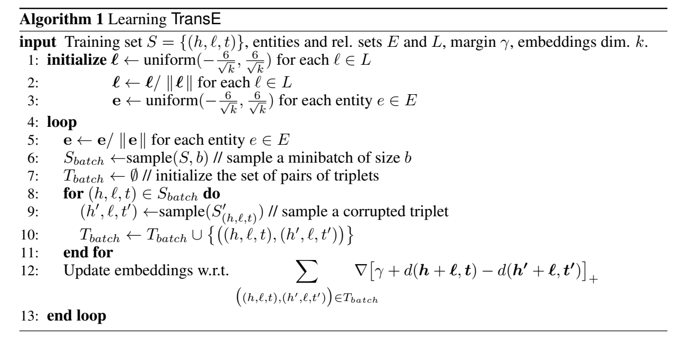
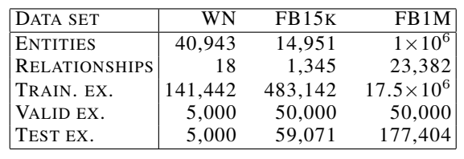
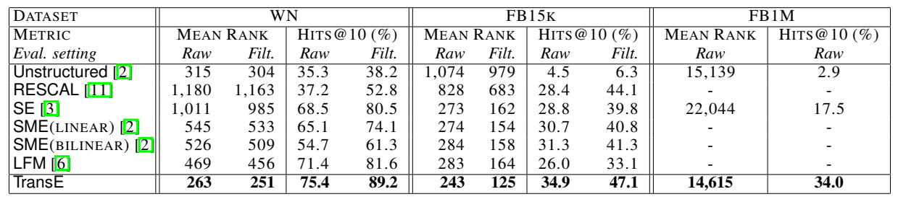

## Paper
**TransE** : Translating Embeddings for Modeling Multi-relational Data

**Year** : 2013

**Author** : Antoine Bordes

#### Algorithm

#### Dataset Used

#### Paper Result

## Code

#### Running Result

| dataset | dim  | epoch | batch size | lr   | margin | d_norm | Mean Rank       | hits@10(%)         |
| :-----: | ---- | ----- | ---------- | ---- | ------ | ------ | --------------- | ------------------ |
|  FB15k  | 50   | 50    | 1240       | 0.01 | 1.0    | 2      | 315             | 34.51              |
|  WN18   | 50   | 800   | 128        | 0.01 | 1.0    | 2      | 316             | 64.84 (未调参)      |

#### Question Record
1. 数据集构建时`__getitem__()`函数重写时，返回正负样本的格式为`list`：`[self.pos_data[item], self.neg_data[item]]`即可，不必转化为`numpy.array`，否则在后面`DataLoader`取`batch`时会有问题。

2. 在求范数时忘记了设置`dim=1`，导致`loss`计算结果与别人的实现相差很远。参考别人的实现写代码时候要细心、动脑子。

3. `bug: RuntimeError: CUDA out of memory. Tried to allocate 164.50 GiB (GPU 2; 10.92 GiB total capacity; 19.66 MiB already allocated; 10.40 GiB free; 14.34 MiB cached)`

   原因：测试集数据载入的`batch size`设置得太大了，把测试集作为一整个`batch`，在`tail_predict`中进行矩阵运算时候会爆内存，因为测试时需要对测试集中的每个三元组赋予整个实体集中的实体，会占据大量的计算力和内存空间，因此要对测试集设置合适的`batch size`，训练集的`batch size`可设大些，利于提升训练速率。

   在`KG2E`的实现中将整个测试集作为整个`batch`没有爆内存的原因是，计算`MRR`时，是针对每个测试样本单独测试，没有整个`batch`一起操作。
   
4. 小疑问：验证时候没有将代码包裹在`with torch.no_grad()`内，为什么没有出问题？
5. `batch size`设置为`1240`时，所需内存约4.8G，主要在验证阶段。